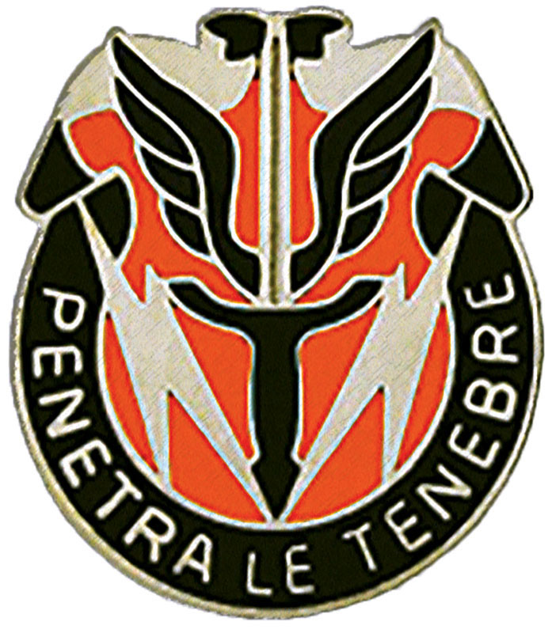

# 112th Signal Battalion GitHub Lab
### Sections
- [Resources](#resources)
- [Introduction](#introduction)
- [Creating a Remote GitHub Repository](#creating-a-remote-github-repository)

### Resources
- [Git Documentation](https://git-scm.com/doc)
- [GitHub](https://github.com)
- [GitHub Markdown Formatting](https://docs.github.com/en/get-started/writing-on-github/getting-started-with-writing-and-formatting-on-github/basic-writing-and-formatting-syntax)

### Introduction
- This lab will walk you through some of the most common git actions using the GitHub Source Control Management (SCM) developer platform

### Creating a Remote GitHub Repository
- 